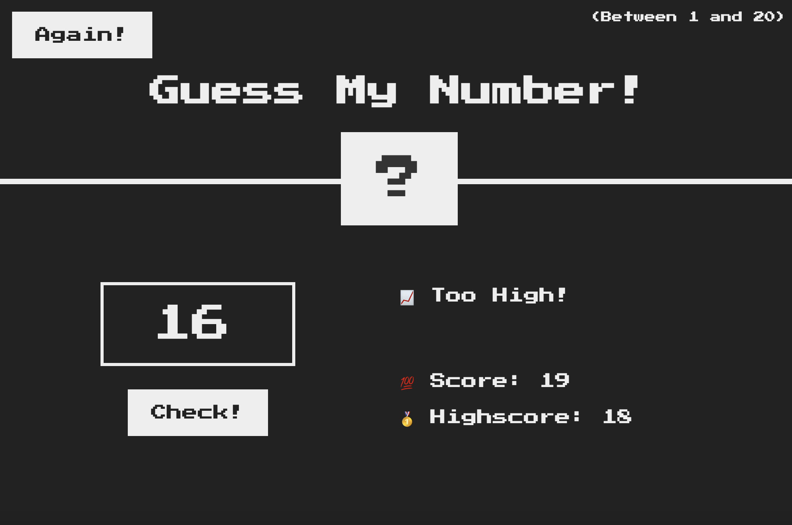
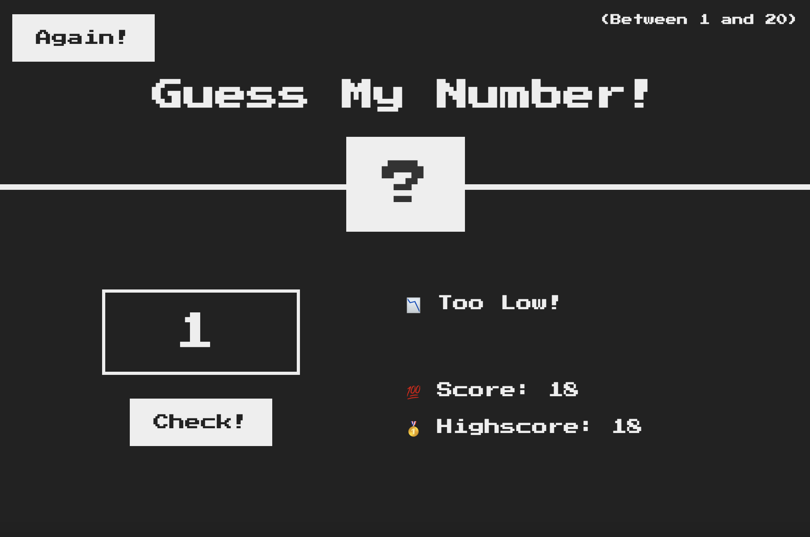
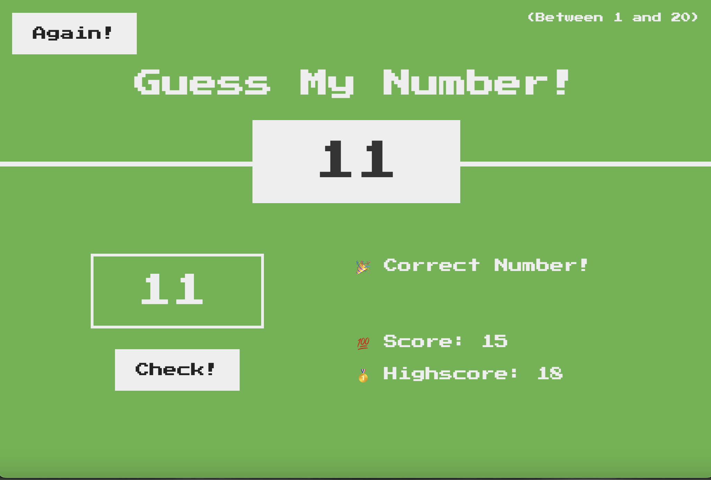

# Guess My Number

## User Story

Guess My Number is a simple web-based game where users try to guess a randomly generated number between 1 and 20. The number is hidden behind a question mark, and the game will provide feedback on whether the guess is too high or too low. Users can play multiple rounds, and the game tracks their highest score across sessions.

## Acceptance Criteria

GIVEN the game has started
WHEN the user inputs a number between 1-20
THEN the system will indicate if the guess is too high, too low, or correct

GIVEN the user has played a round of the game
WHEN the user guesses the correct number and ends the game
WHEN the user clicks an "Again" button
THEN the game will generate a new random number, reset the score, and allow the user to start guessing again

## Mock-Up

When a User guesses too high:

When a User guesses too low:

When a User guesses correctly:

---

© Adriana Nino [GitHub Repo](https://github.com/ninadri/guess-my-number)
